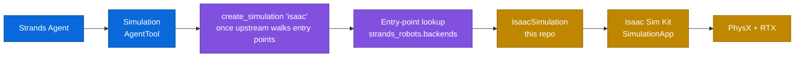

<div align="center">
  <h1>Strands Robots Sim</h1>

  <h2>The GPU-accelerated NVIDIA Isaac Sim backend for <a href="https://github.com/strands-labs/robots"><code>strands-robots</code></a></h2>

  <div align="center">
    <a href="https://pypi.org/project/strands-robots-sim/"></a>
    <a href="https://github.com/strands-labs/robots-sim"></a>
    <a href="https://github.com/strands-labs/robots-sim/blob/main/LICENSE"></a>
    <a href="https://strands-labs.github.io/robots-sim/"></a>
    <a href="https://developer.nvidia.com/isaac-sim"></a>
  </div>

  <p>
    <a href="https://strands-labs.github.io/robots-sim/">Docs</a>
    ◆ <a href="https://github.com/strands-labs/robots">strands-robots</a>
    ◆ <a href="https://strands-labs.github.io/robots/">Robots Docs</a>
    ◆ <a href="https://developer.nvidia.com/isaac-sim">NVIDIA Isaac Sim</a>
    ◆ <a href="https://github.com/orgs/strands-labs/projects/2">Project Board</a>
  </p>
</div>

`strands-robots-sim` is the GPU-accelerated Isaac Sim companion to
[`strands-robots`](https://github.com/strands-labs/robots). It ships an
**`IsaacSimulation`** that plugs into the same `SimEngine` ABC the upstream
MuJoCo backend implements, so a Strands Agent that drives a MuJoCo world
today switches to Isaac Sim by swapping the backend it constructs.

```python
from strands_robots_sim.isaac import IsaacSimulation, IsaacConfig

sim = IsaacSimulation(IsaacConfig(render_mode="rtx_realtime", headless=True))
sim.create_world()
sim.add_robot("so100")                          # procedural; no asset files needed
sim.step(100)
frame = sim.render(camera_name="default")
```

> **Note:** `IsaacSimulation` is also registered as a `strands_robots.backends`
> entry point, but no released `strands-robots` (`>=0.3.8,<0.4`) walks that
> group from `create_simulation` yet, so `create_simulation("isaac")` raises
> `ValueError: Unknown simulation backend: 'isaac'`. Construct `IsaacSimulation`
> directly until the upstream entry-point walker ships
> ([`strands-labs/robots#131`](https://github.com/strands-labs/robots/issues/131)).

> **📚 Documentation:** <https://strands-labs.github.io/robots-sim/>
>
> Includes a [Quickstart](https://strands-labs.github.io/robots-sim/getting-started/quickstart/),
> the [Architecture](https://strands-labs.github.io/robots-sim/architecture/)
> behind the plugin contract, the
> [Backend reference](https://strands-labs.github.io/robots-sim/backends/isaac/),
> and [Troubleshooting](https://strands-labs.github.io/robots-sim/troubleshooting/).

## Why robots-sim

- **RTX path-traced rendering.** Photoreal observations, paper-grade
  frames, sim2real visuals — driven by the same agent code your MuJoCo
  smoke tests use.
- **USD-native scenes.** Real CAD assets, Nucleus support, IsaacLab
  compatibility.
- **Replicator synth-data.** Domain randomization at scale; ground-truth
  depth, segmentation, and bounding boxes alongside RGB.
- **Fleet RL on PhysX GPU.** 1024+ parallel envs with shared USD scenes.
- **Plugin shape, not a fork.** `strands-robots` has zero hard dependency
  on Isaac Sim — install this package and Isaac is discovered through
  entry points.

If none of those apply, install the lightweight default at
[`strands-labs/robots`](https://github.com/strands-labs/robots) instead —
it runs everywhere (including Apple Silicon), boots in seconds, and the
agent contract is identical.

## How it works



`strands-robots-sim` registers `IsaacSimulation` as a
`strands_robots.backends` entry point. The intent is that
`create_simulation("isaac")` walks the entry-point group, imports the target
string, and instantiates it — but no released `strands-robots` (`>=0.3.8,<0.4`)
ships that walker yet, so today you construct `IsaacSimulation` directly (see
[Quick start](#quick-start)). The full plugin contract is documented in
[Architecture](https://strands-labs.github.io/robots-sim/architecture/).

## Installation

System requirements: **NVIDIA RTX GPU, Ubuntu 22.04+, CUDA 12+, Isaac Sim 4.x**.
macOS / Apple Silicon contributors should install
[`strands-robots`](https://github.com/strands-labs/robots) directly and
skip this repo.

```bash
# Step 1 — install Isaac Sim itself (NOT on PyPI):
#   - Omniverse Launcher → Isaac Sim 4.x, OR
#   - Isaac Lab: git clone IsaacLab && ./isaaclab.sh -i, OR
#   - NGC Docker: docker pull nvcr.io/nvidia/isaac-sim:4.5.0

# Step 2 — install the Python plugin:
pip install 'strands-robots-sim[isaac]'
```

`strands-robots` (the upstream MuJoCo backend, `Simulation` AgentTool,
and policy providers) is pulled in transitively.

Full install matrix in
[Getting Started → Installation](https://strands-labs.github.io/robots-sim/getting-started/installation/).

## Quick start

### Single-env RTX render

```python
from strands_robots_sim.isaac import IsaacSimulation, IsaacConfig

sim = IsaacSimulation(IsaacConfig(render_mode="rtx_pathtracing", headless=True))
sim.create_world()
sim.add_robot("so100")                          # procedural builder
sim.add_object(name="cube", shape="cuboid",
               position=[0.4, 0.0, 0.05], scale=[0.05, 0.05, 0.05])
sim.add_camera(name="front", position=[1.2, 0.0, 0.6], target=[0.0, 0.0, 0.1])
sim.step(120)
frame = sim.render(camera_name="front")          # {"rgb": ..., "depth": ...}
sim.destroy()
```

### IsaacLab-style fleet (preview)

```python
sim = IsaacSimulation(IsaacConfig(num_envs=1024, headless=True,
                                  render_mode="headless"))
sim.create_world()
sim.add_robot(name="panda", usd_path="/path/to/franka.usda")
# ... RL training loop ...
```

### URDF / MJCF / USD ingestion

```python
from strands_robots_sim.isaac.loaders import load_urdf, load_mjcf, load_usd

panda = load_urdf("/path/to/panda.urdf")         # stdlib XML, no extra deps
print(panda.num_joints, panda.joint_names)
```

## Backend matrix

| Capability | MuJoCo<br/>(`strands-robots`) | **Isaac Sim**<br/>(this repo) |
|---|:---:|:---:|
| Native GPU | — | ✅ PhysX |
| Apple Silicon | ✅ | ❌ |
| Photoreal rendering | — | ✅ RTX path-traced |
| `num_envs` per GPU | 1–8 | 1024+ |
| USD scene format | — | ✅ native |
| Synthetic data (Replicator) | — | ✅ |
| Download size | ~50 MB | ~30 GB |
| Setup friction | low | high |

- **Pick MuJoCo** for fast iteration, debugging, macOS / Apple Silicon, CI.
- **Pick Isaac Sim** for RTX photoreal eval, USD-native scenes, IsaacLab
  fleet RL, or Replicator synth-data.

The full per-backend table with install hints lives in
[Simulation → Overview](https://strands-labs.github.io/robots-sim/simulation/overview/).

## Simulation surface

`IsaacSimulation` exposes the same `SimEngine` shape MuJoCo does:

```
World & lifecycle    create_world / destroy / reset / step / get_state / cleanup
Robots               add_robot (procedural | USD | URDF) / remove_robot / list_robots
                     robot_joint_names / send_action / get_observation
Objects              add_object (cuboid / sphere / cylinder / capsule, dynamic / static)
                     remove_object
Cameras & rendering  add_camera (look-at, FOV) / render (RGB + depth)
Loaders              load_urdf / load_mjcf / load_usd  → ProceduralRobot dataclass
```

Full reference: [Simulation → World Building](https://strands-labs.github.io/robots-sim/simulation/world-building/).

## Examples

The repo ships runnable LIBERO drivers under `examples/libero/`:

| File | Driver | Best for |
|---|---|---|
| `libero/run_isaac.py` | Programmatic — `evaluate_benchmark(...)` | CI / matrix tables |
| `libero/run_isaac_agent.py` | Strands `Agent` + natural language | Demos |
| `libero/libero_backend_matrix.py` | Flagship matrix runner — walks all backend rows ([R15 / #22](https://github.com/strands-labs/robots-sim/issues/22)) | Side-by-side backend comparison |

Plus visually-driven demos:

- [`examples/isaac_gs/`](examples/isaac_gs) — Isaac Sim + 3DGS hybrid-render digital twin
- [`examples/so101_curobo/isaac/`](examples/so101_curobo) — SO-101 synth-data with cuRobo on Isaac

```bash
# Smoke test (mock policy, no GPU policy server):
python examples/libero/run_isaac.py --policy mock --n-episodes 5

# Real eval against an NVIDIA GR00T checkpoint:
python examples/libero/run_isaac.py --policy groot --port 8000 --n-episodes 50
```

Full driver matrix: [Examples → Overview](https://strands-labs.github.io/robots-sim/examples/overview/).

## Project structure

```
strands_robots_sim/
├── __init__.py                # PEP 562 lazy exports
└── isaac/
    ├── __init__.py            # IsaacConfig, IsaacSimulation lazy exports
    ├── _install.py            # single source of truth for install metadata
    ├── config.py              # IsaacConfig dataclass + validation
    ├── simulation.py          # IsaacSimulation(SimEngine) — main backend
    ├── procedural.py          # SO-100 / Panda / G1 builders + tree validator
    ├── loaders.py             # URDF / MJCF / USD → ProceduralRobot
    └── tests/                 # unit + GPU-integration tests
docs/                          # MkDocs Material site (deployed to GitHub Pages)
examples/
├── libero/                    # LIBERO drivers (run_isaac.py + run_isaac_agent.py)
├── isaac_gs/                  # Isaac Sim + 3DGS hybrid-render demo
└── so101_curobo/              # SO-101 synth-data with cuRobo on Isaac
```

## Status

- **v0.2.0** — re-scoped foundation (Isaac plugin shape, MuJoCo back upstream).
- **v0.3.0** — Isaac Sim Phase 1 (entry-point registration, `IsaacConfig`,
  `IsaacSimulation` lifecycle, procedural builders, URDF / MJCF / USD
  loaders) shipped on `main`; data-plane wiring (`add_object`, `add_camera`,
  `render`, USD- and URDF-loaded articulations) shipping incrementally.
- **R9** — Replicator synth-data pipeline, tracked in [#16](https://github.com/strands-labs/robots-sim/issues/16).
- **R23** — IsaacLab-style fleet driver, tracked in [#27](https://github.com/strands-labs/robots-sim/issues/27).

Track the umbrella roadmap at [`#8`](https://github.com/strands-labs/robots-sim/issues/8).
Migration from the legacy 0.1.x API: [`examples/MIGRATION.md`](examples/MIGRATION.md).

## Development

```bash
pip install -e '.[isaac,dev]'

hatch run lint           # black --check + isort --check + flake8
hatch run format         # black + isort
hatch run test           # pytest strands_robots_sim/isaac/tests/

# GPU integration tests (requires Isaac Sim on the host):
STRANDS_GPU_TEST=1 pytest strands_robots_sim/isaac/tests/test_gpu_integ.py -v
```

Docs are MkDocs Material; build locally with:

```bash
pip install -r docs/requirements.txt
mkdocs serve                 # live-reload at http://127.0.0.1:8000
mkdocs build --strict        # CI's check
```

Python 3.10+ required (mirroring Isaac Sim 4.5's bundled interpreter).
See [Contributing](https://strands-labs.github.io/robots-sim/contributing/) for the full guide.

## Security

Found a vulnerability? **Do not** open a public issue. Follow the
disclosure process in [SECURITY.md](SECURITY.md) (AWS VDP / HackerOne).

## Contributing

Issues and PRs welcome. Track work on the
[Strands Labs - Robots project board](https://github.com/orgs/strands-labs/projects/2);
it is the source of truth for roadmap and follow-ups.

- [GitHub Issues](https://github.com/strands-labs/robots-sim/issues)
- [Pull Requests](https://github.com/strands-labs/robots-sim/pulls)

## License

Apache-2.0 — see [`LICENSE`](LICENSE).

## Links

<div align="center">
  <a href="https://github.com/strands-labs/robots-sim">GitHub</a>
  ◆ <a href="https://strands-labs.github.io/robots-sim/">Docs</a>
  ◆ <a href="https://pypi.org/project/strands-robots-sim/">PyPI</a>
  ◆ <a href="https://github.com/strands-labs/robots">strands-robots</a>
  ◆ <a href="https://strands-labs.github.io/robots/">Robots Docs</a>
  ◆ <a href="https://developer.nvidia.com/isaac-sim">NVIDIA Isaac Sim</a>
  ◆ <a href="https://isaac-sim.github.io/IsaacLab/">IsaacLab</a>
</div>
