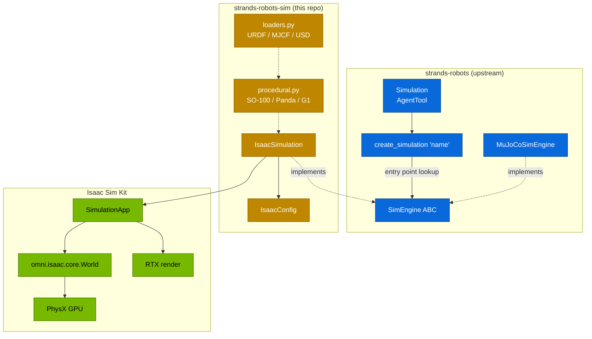
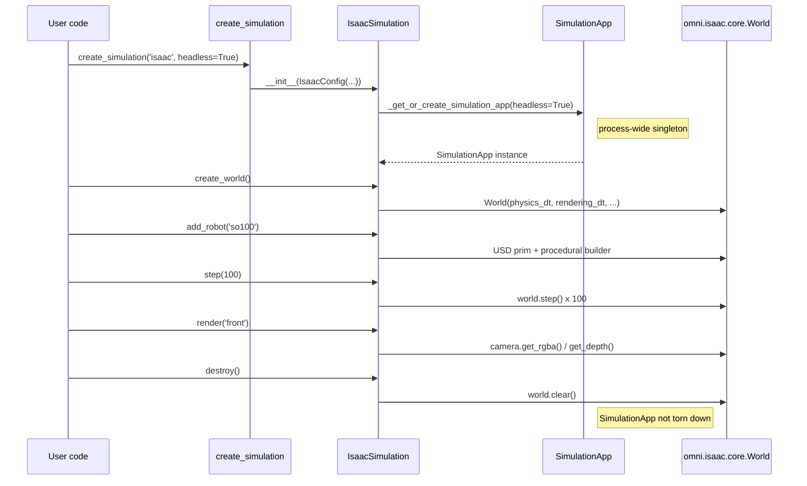

# Architecture

`strands-robots-sim` is a **plugin** for `strands-robots`, not a fork of it.
The upstream package ships the agent-facing `Simulation` AgentTool, the
`SimEngine` ABC, and a default MuJoCo backend. This repo adds an
`IsaacSimulation` that plugs into the same `SimEngine` ABC and registers
itself through Python entry points so the upstream package never needs a
hard dependency on Isaac Sim.

The result: an agent that drives a MuJoCo world today switches to Isaac Sim
by changing one string.

## The plugin contract



The contract has three pieces.

### 1. `SimEngine` ABC (upstream)

Every backend implements the same set of lifecycle + scene + physics +
render methods:

```python
class SimEngine(ABC):
    def create_world(self, **kwargs) -> dict: ...
    def destroy(self) -> dict: ...
    def reset(self, env_ids: list[int] | None = None) -> dict: ...
    def step(self, n_steps: int = 1) -> dict: ...
    def get_state(self) -> dict: ...

    def add_robot(self, name: str, **kwargs) -> dict: ...
    def remove_robot(self, name: str) -> dict: ...
    def list_robots(self) -> list[str]: ...
    def robot_joint_names(self, robot_name: str) -> list[str]: ...

    def add_object(self, name: str, **kwargs) -> dict: ...
    def remove_object(self, name: str) -> dict: ...
    def add_camera(self, name: str, **kwargs) -> dict: ...

    def get_observation(self, robot_name: str | None = None,
                        *, skip_images: bool = False) -> dict: ...
    def send_action(self, action, robot_name=None,
                    n_substeps: int = 1) -> dict: ...
    def render(self, camera_name: str = "default",
               width=None, height=None) -> dict: ...
```

The MuJoCo backend in `strands-robots` and `IsaacSimulation` here are both
`SimEngine` subclasses. The agent / policy loop talks to `SimEngine` and
never knows which backend is underneath.

### 2. Entry-point registration (this repo)

`strands-robots-sim` declares its backends as entry points in
[`pyproject.toml`](https://github.com/strands-labs/robots-sim/blob/main/pyproject.toml):

```toml
[project.entry-points."strands_robots.backends"]
isaac = "strands_robots_sim.isaac.simulation:IsaacSimulation"
```

When `strands-robots-sim` is installed, `importlib.metadata.entry_points`
sees the `isaac` name. The intended flow is that `create_simulation("isaac", ...)`
upstream walks the `strands_robots.backends` group, finds the `isaac` entry,
imports the target string, and instantiates it.

!!! warning "Discovery is not live in the pinned upstream yet"

    No released `strands-robots` (this package pins `>=0.3.8,<0.4`) walks the
    `strands_robots.backends` group from its `create_simulation` factory, so
    `create_simulation("isaac")` currently raises
    `ValueError: Unknown simulation backend: 'isaac'`. Until the upstream
    walker ships
    ([`strands-labs/robots#131`](https://github.com/strands-labs/robots/issues/131)),
    construct the backend directly with
    `IsaacSimulation(IsaacConfig(...))`. The entry-point declaration here is
    forward-compatible plumbing: once upstream walks the group, no change to
    this package is required.

This is the same pattern other packages use to extend `strands-robots`
(future cuRobo / MoveIt2 backends, custom user backends). The upstream
package has zero hard dependency on `omni.*`.

### 3. Lazy `omni.*` imports (this repo)

Importing `strands_robots_sim` must not import `omni.*` — that would force
every `strands-robots` user to have Isaac Sim installed, defeating the
plugin design. We use **PEP 562 lazy module-level `__getattr__`** so
`from strands_robots_sim.isaac import IsaacSimulation` only triggers the
expensive `omni.*` import on first attribute access:

```python
# strands_robots_sim/isaac/__init__.py (sketch)
def __getattr__(name: str):
    if name == "IsaacSimulation":
        from .simulation import IsaacSimulation
        return IsaacSimulation
    if name == "IsaacConfig":
        from .config import IsaacConfig
        return IsaacConfig
    raise AttributeError(name)
```

Combined with `IsaacSimulation.is_available()`, this means a CPU-only dev
box can:

- `pip install 'strands-robots-sim[isaac]'` without errors,
- `import strands_robots_sim` (registers the entry point),
- call `IsaacSimulation.is_available()` and get a structured diagnostic
  back, **before** any `omni.*` import is attempted.

Only when the user asks for a real `IsaacSimulation(config)` do we boot
the `SimulationApp` singleton.

## Lifecycle



Two invariants you will hit if you ignore them:

- **`SimulationApp` is process-wide.** Creating a second `IsaacSimulation`
  reuses the same `SimulationApp`. `destroy()` clears the *world* but
  intentionally does **not** kill the `SimulationApp` — Kit cannot
  re-bootstrap inside a single process.
- **`step()` and `add_robot()` cannot run concurrently.** All mutable state
  is protected by an `RLock`; calls block, they don't race.

## What lives in this repo vs. upstream

| Concern | Lives in | Why |
|---|---|---|
| `Simulation` AgentTool, `SimEngine` ABC, `create_simulation` factory | `strands-robots` | Upstream owns the agent-facing surface |
| `MuJoCoSimEngine`, `MockPolicy`, LIBERO adapter | `strands-robots` | Default backend; runs everywhere |
| `IsaacSimulation`, `IsaacConfig`, procedural builders, URDF/MJCF/USD loaders | `strands-robots-sim` (here) | GPU-accelerated NVIDIA-only dependency |
| Robot catalog (`robots.json`), policy providers (GR00T, LeRobot, cuRobo) | `strands-robots` | Backend-agnostic |
| Hardware (`HardwareRobot`, mesh, IoT, device-connect) | `strands-robots` | Same |
| Replicator synth-data pipeline | `strands-robots-sim` (here) | Isaac-specific |
| LIBERO `run_isaac.py` / `run_isaac_agent.py` example drivers | `strands-robots-sim` (here) | Backend-specific entry points |

The split is deliberate: `strands-robots` is the agent's view of the
world; `strands-robots-sim` is the GPU-accelerated Isaac plumbing behind one of the
plug-in slots that view exposes.

## Next

- [Simulation → Overview](simulation/overview.md) — `IsaacConfig`, headless
  vs. RTX modes, world lifecycle.
- [Simulation → World Building](simulation/world-building.md) — the
  `add_robot` / `add_object` / `add_camera` / `render` surface.
- [API Reference](api-reference.md) — class signatures.
- [Backends → Isaac Sim](backends/isaac.md) — the full backend reference.
